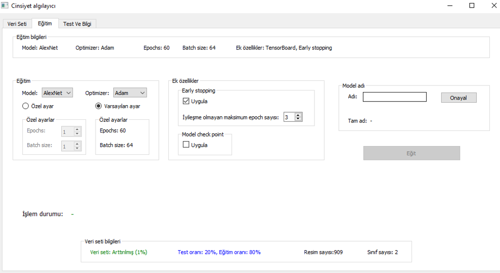

# Tensorflow Gender Dedection with Transfer Learning

## Used Tools
- TensorFlow, TensorBoard
- PyQt5
- NumPy
- Matplotlib
- scikit-learn


## Quick Installation
```
pip install -r requirements.txt
```
## Run Project
```
python cinsiyet_algila.py
```


## Features
- User friendly GUI.
- Data augmentation.
- Dataset splitting.
- Transfer learning with diferent models.
- Multiple trained model storeing and testing.
- Model visualization with tensorboard.

> ⚠️ For more details: [Report](./report.pdf)


## Screenshots
<p align="center">
  
  
</p>


## License
MIT
